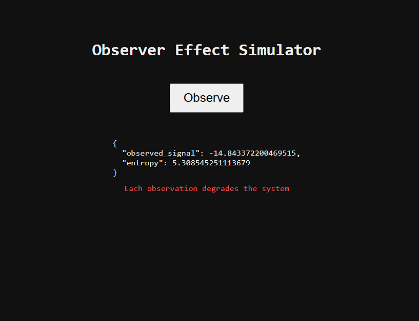

# observer_effect_simulator
## Layout

open project in jouw browser http://127.0.0.1:8000/
Observer Effect Simulator is een minimale web-simulator die laat zien hoe observatie zelf een systeem verandert.
Elke meting muteert de interne toestand, verhoogt entropie en beïnvloedt toekomstige uitkomsten.
Na het overschrijden van een kritische drempel stort het systeem onomkeerbaar in.
Het project is technisch strikt, deterministisch-chaotisch en bedoeld als experimenteel model voor feedback, informatieverlies en irreversibele observatie.
